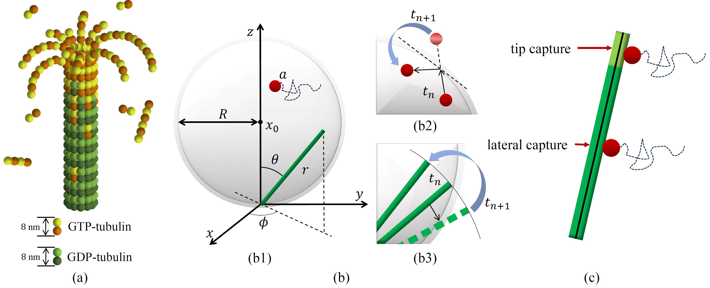

# Feynman-Kac equation for microtubule search process in prometaphase

Authors: Heng Wang (wheng2025@lzu.edu.cn) and Weihua Deng (dengwh@lzu.edu.cn)

Address: School of Mathematics and Statistics, State Key Laboratory of Natural Product Chemistry, Lanzhou University, Lanzhou 730000, China.

# Environment configuration

python==3.13.5 torch==2.8.0+cu126

# Abstract

In prometaphase, microtubules form the spindle structure through dynamic instability, accurately locating and capturing chromosomes to ensure the equal distribution of genetic material (DNA on chromosomes).
In this paper, we establish a dynamic model of the microtubule growth-rotation search process by considering the non-local polymerization and depolymerization of microtubules affected by mechanisms such as katanin proteins and kinetochore fibers, and derive the macroscopic equation for the microtubule-kinetochore capture model by imposing appropriate boundary conditions. 
Further, We derive the Feynman-Kac equations that govern the probability density of the functional for the microtubule growth-rotation search model.
Finally, we validate the correctness of the derived equations by comparing results from deep learning method with those from Monte Carlo simulations.

# Example
We provide some invocation `example` in the Scripts `"./rotation.ipynb"` and `"./mkcaputre.ipynb"`, where you can define and modify any of the components in the sample for testing.